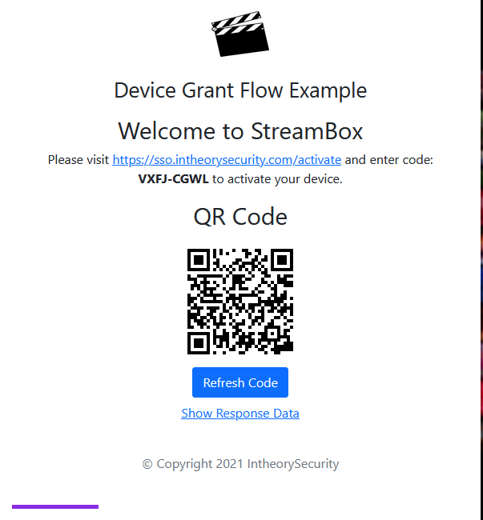

# Device Authorization Grant Flow Demo (Web)

This project allows you simulate Okta's Device Authorization Grant Flow within your browser.

For additional information about the Device Authorization Grant please visit Auth0 Documentation [page](https://auth0.com/docs/get-started/authentication-and-authorization-flow/device-authorization-flow).

## Disclaimer :warning:

This project serves as a Sample Application, that you can tweak or completely re-purpose. It is community-supported and is maintained by members of the Okta team for developers and other IT professionals. This is not an official Okta product and does not qualify for any Okta support. Okta makes no warranties regarding this project. Anyone who chooses to use this project must ensure that their implementation meets any applicable legal obligations including any Okta terms and conditions.

## Prerequisites

* Auth0 Tenant - If you do not already an Auth0 tenant, you can register for a free [Auth0 Free Plan](https://auth0.com/signup)
* An OIDC applications to use Device Authorization Grant. [How-to](https://auth0.com/docs/get-started/authentication-and-authorization-flow/call-your-api-using-the-device-authorization-flow)
* Node v14.0.0+
* npm v6.14.15+

## Installation and Configuration

1. Clone the repo.

```bash
git clone https://github.com/whitesand230/auth0-streaming-service-demo.git
```

2. Install dependencies based on package.json.

```bash
npm install
```

3. Copy the contents of the .env.example file.

```bash
#Windows
copy .env.example .env

#Linux
cp .env.example .env
```

4. Update variables in the .env file.
```bash
# Auth0 Configuration
# ie.
# AUTH0_HOST=AUTH0Domain.us.auth0.com
# CLIENT_ID=0oa...0h8
#
AUTH0_HOST=<AUTH0 URL>
CLIENT_ID=<APPLICATION CLIENT ID>

# Optional Configuration
# Default Scopes are set to: "openid offline_access profile"
# ie
# SCOPES=custom-scope-1 custom-scope-2
#
# SCOPES=<REQUIRED SCOPES>

# Enable for verbose logging. Defaults to false
# DEBUG=false
```

5. Save the .env file.

## Usage

To start the express server, enter the following command

```bash
npm run start
```

6. Open http://localhost:8080 on your browser of choice. You will see the following screen.



## Contributing

Pull requests are welcome. For major changes, please open an issue first to discuss what you would like to change.

Please make sure to update tests as appropriate.

## License

[MIT](https://choosealicense.com/licenses/mit/)